# 2025年你必须了解的12款顶级AI头脑风暴工具(持续更新)

团队头脑风暴总是遇到各种问题:点子散落一地理不出头绪、远程参会的人插不上话、会后整理记录又要花半天时间、创意讨论缺乏结构最后不了了之。传统的白板和便签纸在远程时代已经不够用了,纯文字记录又丢失了思维的可视化呈现。AI驱动的可视化头脑风暴工具能让你的团队实时协作生成想法、自动分类整理创意、用AI副驾驶提供多角度反馈,并即时生成会议总结和行动计划。这份榜单精选了12个靠谱的AI头脑风暴和思维导图工具,涵盖实时协作、AI生成创意、可视化呈现、框架模板等核心功能,帮你找到最适合团队创新工作流的那一款。

## **[Ideamap](https://ideamap.ai)**

AI从零开始设计的头脑风暴平台,让混乱变有序的秘密武器。

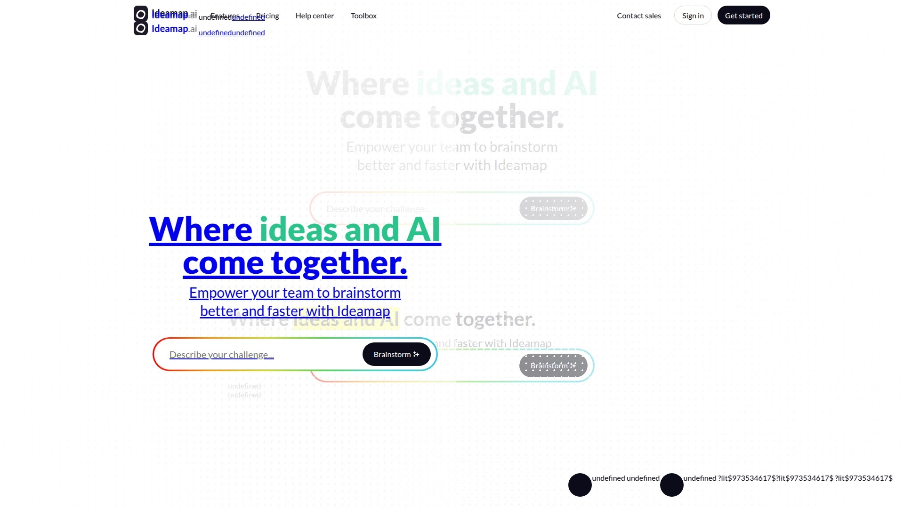

Ideamap不是在传统工具上加AI功能,而是完全围绕AI和人类创造力协作从头构建的头脑风暴应用。核心特色是AI副驾驶系统——你可以邀请不同性格的AI角色参与讨论,比如"挑剔的Gus"会专门给你的点子挑毛病压力测试,"乐观的Newt"则提供鼓励和扩展思路。这种多视角的AI反馈模拟了异质化团队的讨论效果,对个人或同质化团队特别有价值。AI自动分类功能堪称神器:当你和团队丢出几十个零散想法后,一键就能把"交互工具""匿名反馈""Trello集成"这些点子自动归类到"可视化""心理安全""工作流集成"等主题下,省去大量手动整理时间。无限画布支持实时协作,所有人的光标都能看见,投票系统包括点阵和ELO评分等高级方法。提供SCAMPER、迪士尼方法、六顶思考帽等经典框架模板一键应用。与微软Teams深度集成,可以直接在Teams里启动头脑风暴会话。支持CSV、XLSX、PDF、PNG多格式导出,想法不会被困在工具里。使用GPT-3.5/GPT-4做文本生成,Stability AI做图像可视化。基础版免费,付费版按用户订阅。无论你是产品经理规划新功能、营销团队策划活动、还是初创公司探索商业模式,Ideamap的AI辅助思考和自动整理能力能让混乱的头脑风暴变成结构化的可执行计划。

## **[Miro](https://miro.com)**

全球2500万用户的数字白板之王,现在有AI加持了。

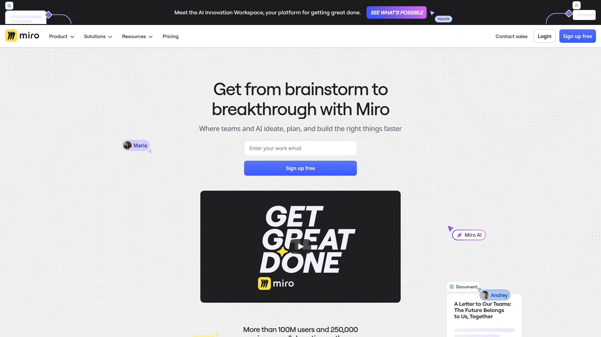

Miro是业内最成熟的在线协作白板平台,被超过96%的财富500强公司使用。无限画布可以容纳你想要的任何内容——便签、图表、思维导图、流程图、线框图、甘特图应有尽有。现在引入的Miro Assist AI功能能帮你生成想法、总结讨论、聚类分散的便签。实时协作体验非常流畅,支持无限参与者同时编辑,视频聊天、评论、投票、计时器等功能齐全。模板库超过2500个涵盖各种使用场景,从设计冲刺、用户故事地图到回顾会议、SWOT分析都有现成框架。与Zoom、Slack、Microsoft Teams、Google Workspace、Jira、Asana等上百个工具深度集成。支持触屏设备和数字白板硬件,从手机到85寸大屏都能用。提供企业级安全和管理功能,包括SSO、权限控制、审计日志。免费版支持3个可编辑白板,付费版从每月8美元起。如果你需要的是成熟稳定、功能全面、生态丰富的协作平台,Miro的市场地位和持续迭代能力让它成为安全选择。

## **[Xmind](https://xmind.com)**

风靡全球的经典思维导图工具,AI功能让创建速度飞升。

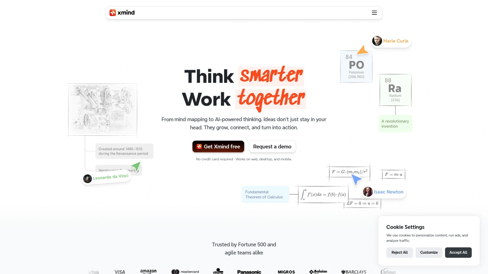

Xmind是思维导图领域的老牌劲旅,全球数百万用户的选择。2025版本加入AI驱动功能,你可以选模板让AI构建结构,然后按自己的方式定制。支持多种思维导图布局——组织架构图、树状图、时间轴、鱼骨图、逻辑图应有尽有,甚至能做ZEN模式专注创作。可视化效果精美,主题样式、图标、贴纸、配色方案可以自由组合,导出的图片质量高到可以直接用在演示文稿里。支持Markdown格式、大纲视图、演示模式,一份内容多种呈现方式。跨平台同步做得很好,Windows、Mac、Linux、iOS、Android全覆盖,云端自动保存。协作功能支持多人实时编辑和评论。文件可以导出为PDF、PNG、SVG、FreeMind、XMind等多种格式,兼容性强。提供免费版和订阅版,个人用户、教育机构、企业都有对应方案。如果你追求的是传统思维导图的精致呈现加上现代AI的效率提升,Xmind的平衡做得很到位。

## **[Notion](https://www.notion.com)**

从笔记到数据库到知识库,现在还能AI生成思维导图。

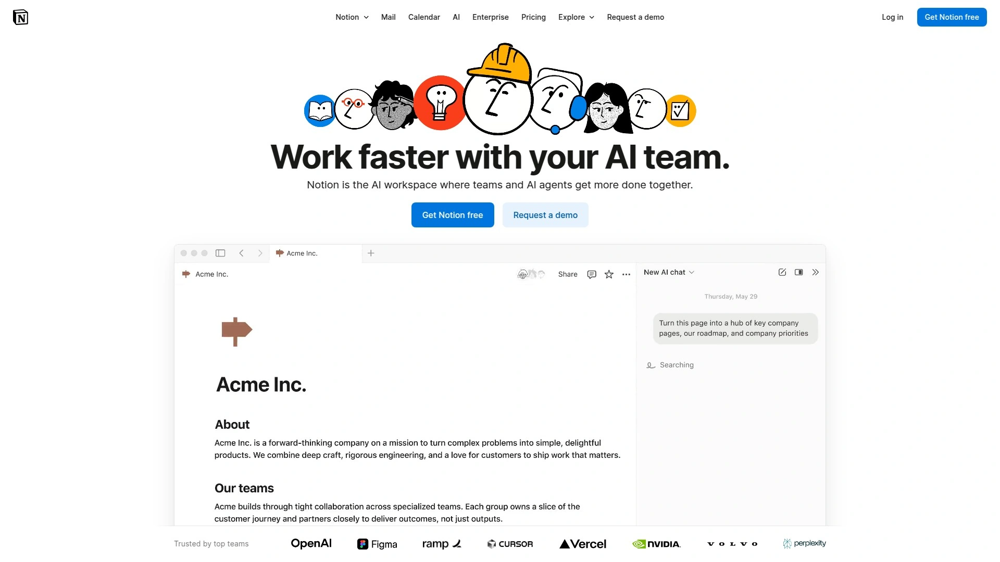

Notion本质是全能工作空间,但它的灵活性让很多团队用它来做头脑风暴和知识管理。页面可以无限嵌套,支持数据库视图(表格、看板、日历、画廊、时间轴),非常适合把零散想法结构化成可执行项目。Notion AI能帮你写作、总结、翻译、头脑风暴、改进文案,虽然不是专门的思维导图工具,但通过Toggle列表、数据库关联、模板系统可以搭建出强大的创意管理流程。实时协作流畅,@提及、评论、权限控制一应俱全。与Slack、Google Drive、Figma、GitHub等工具集成。模板市场有上千个社区贡献的模板,从产品路线图到会议记录到OKR追踪都有。免费版功能已经很强大,个人用完全够用,团队版从每月8美元起。Notion的优势是它不只是头脑风暴工具,而是能让想法从产生、讨论、整理到执行全流程都在一个平台完成,减少工具切换成本。如果你希望创意管理和项目管理无缝衔接,Notion的灵活性无人能敌。

## **[MindManager](https://www.mindmanager.com)**

企业级思维导图标杆,信息可视化能力最强。

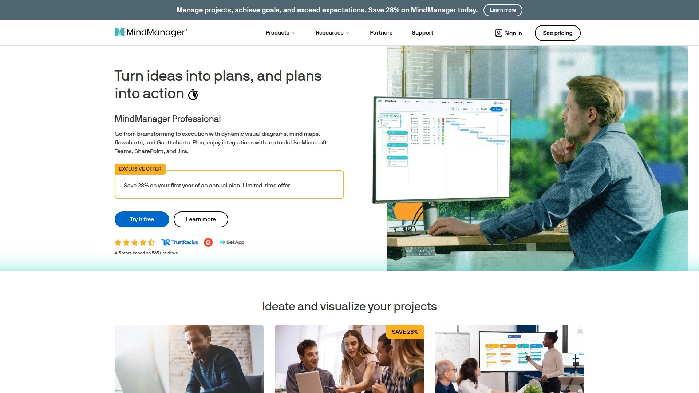

MindManager是行业领先的思维导图和信息可视化软件,在企业市场深耕多年。它不只是画思维导图,更是强大的信息管理和项目规划工具。可以在导图上直接添加任务、截止日期、优先级、资源分配、成本预算,然后导出成甘特图或者同步到项目管理工具。支持附加文档、链接、图片、表格、公式,一张导图就是完整的项目知识库。过滤、搜索、标签功能强大,即使导图有上百个节点也能快速定位。与Microsoft Office、Teams、SharePoint、Outlook深度集成,可以从Excel导入数据、把导图发到PowerPoint、同步Outlook任务。提供桌面版(Windows/Mac)和Web版,支持团队协作和云同步。视觉呈现专业且可定制,非常适合做商业汇报。定价偏高端,年订阅从179美元起,永久许可证更贵,但对需要专业级功能的企业用户物有所值。如果你在大企业环境工作,需要把思维导图和项目管理、文档系统深度融合,MindManager的企业级能力和稳定性值得投资。

## **[Lucidspark](https://lucid.co/lucidspark)**

Lucid家族的头脑风暴专用工具,无缝衔接到执行阶段。

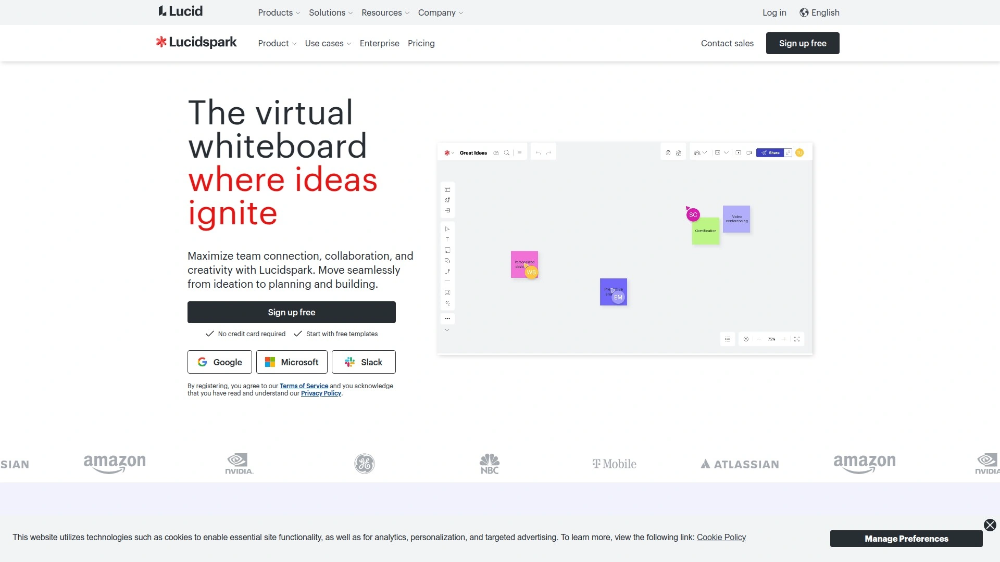

Lucidspark是Lucid可视化协作套件中专注头脑风暴和创意工作坊的成员(另外两个是流程图工具Lucidchart和云架构图工具Lucidscale)。无限画布支持便签、画板、自由绘图、投票、计时器等头脑风暴必备元素。AI功能包括想法生成、自动分组、主题提取。提供引导式协作模板比如设计思维工作坊、回顾会议、SWOT分析,内置facilitator工具帮你主持会议。实时协作体验流畅,支持视频聊天和反应表情。最大优势是跟Lucidchart无缝集成——你可以把头脑风暴的想法直接转换成流程图、用户旅程地图、系统架构图,从ideation到execution一条龙。与微软、Google、Slack、Atlassian全家桶都有集成。免费版支持3个可编辑白板,个人版每月7.95美元,团队版每月9美元。适合需要从创意讨论快速过渡到流程设计和系统规划的产品团队、工程团队、咨询团队。如果你的工作流既需要发散思维也需要收敛执行,Lucid套件的三件套协同价值很高。

## **[Ayoa](https://www.ayoa.com)**

神经多样性友好设计,让不同思维方式的人都能参与。

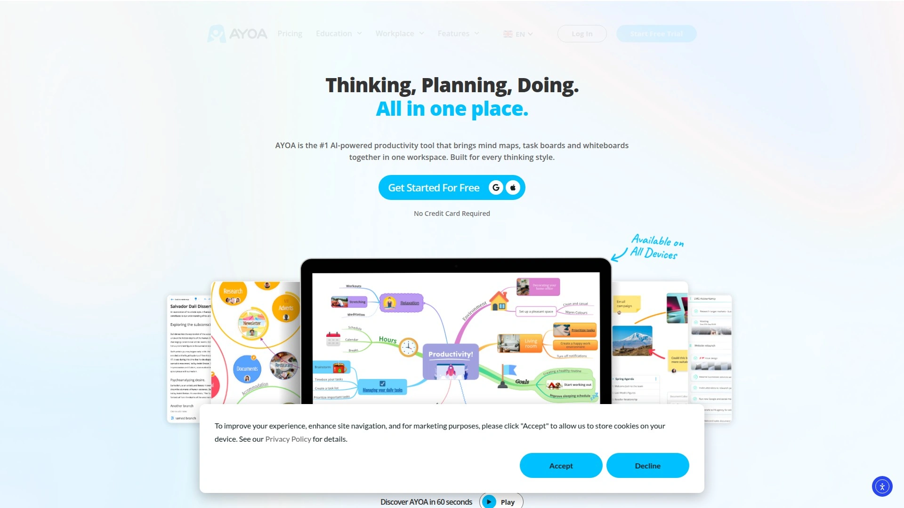

Ayoa是为神经多样性(neurodiversity)专门设计的思维导图和任务管理工具,界面直观、色彩丰富、操作灵活,特别适合多动症、阅读障碍、自闭症等不同认知风格的用户。除了传统思维导图,还提供速度导图(Speed Mind Maps)、径向导图(Radial Maps)、捕捉导图(Capture Maps)等多种可视化形式。AI集成能帮你快速生成导图结构。任务管理功能完整,可以把导图节点直接转成任务、设置提醒、分配给团队成员,支持看板视图和甘特图视图。实时协作流畅,支持评论、投票、权限控制。提供大量模板覆盖商业、教育、个人发展等场景。可以公开分享思维导图,设置访客权限(查看、评论、编辑),甚至加密码保护。跨平台支持Web、Windows、Mac、iOS、Android。免费版功能有限,个人版每月10美元起,团队版每月13美元起。如果你的团队成员思维风格差异大,或者你想打造真正包容的协作环境,Ayoa的神经包容性设计能让所有人都找到舒适的工作方式。

## **[Creately](https://creately.com)**

4000+模板库加可视化数据支持,从头脑风暴到文档化一站搞定。

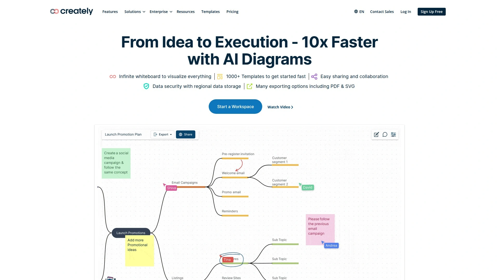

Creately是可视化工作空间平台,结合了白板、思维导图、流程图、线框图、数据库等多种功能。模板库超过4000个,从头脑风暴、设计思维、精益画布到组织架构图、ER图、网络拓扑图应有尽有,基本不用从零开始。可视化数据功能强大——你可以把Excel数据导入生成图表,或者把导图节点链接到数据库字段,实现动态更新。实时协作支持无限用户,视频会议、评论、任务分配、版本历史功能齐全。智能连接器和自动对齐让画图效率提升,不用手动调整位置。支持导出为PNG、SVG、PDF、PPTX多种格式。与Slack、Microsoft Teams、Google Workspace、Confluence集成。免费版支持5个文档,个人版每月5美元,团队版每月8美元。Creately的优势是它既能做发散的创意头脑风暴,也能做结构化的技术文档和流程设计,覆盖从创意到落地的完整周期。特别适合需要跨职能协作、既有创意人员也有技术人员的混合团队。

## **[Conceptboard](https://conceptboard.com)**

欧洲出品的安全协作白板,顾问和教练的最爱。

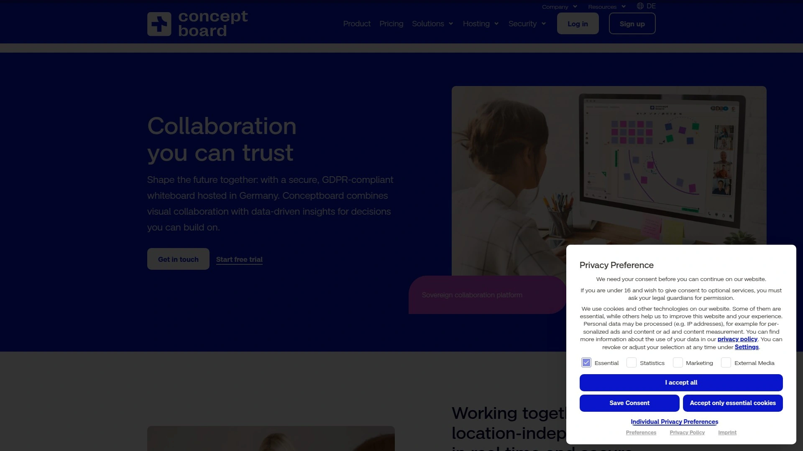

Conceptboard是来自德国的在线协作白板,特别注重数据安全和隐私保护,完全符合GDPR标准。无限画布支持便签、绘图、上传文件、嵌入视频、添加评论等所有白板基础功能。实时协作流畅,支持音视频通话。提供丰富的工作坊模板比如设计思维、精益创业、回顾会议、客户旅程地图。投票和反馈工具帮助团队快速达成共识。版本历史和导出功能完善,支持PDF、PNG、演示模式。与Microsoft Teams、Slack、Dropbox、Google Drive集成。定价从免费版(1个白板)到专业版每月6欧元、团队版每月9欧元。特别适合咨询顾问、教练、培训师使用,很多专业facilitator选择Conceptboard就是因为它的专业性、安全性和客户端演示效果好。如果你经常需要跟客户做可视化工作坊、需要把白板内容嵌入到提案或培训材料里,Conceptboard的专业定位很合适。

## **[Stormboard](https://stormboard.com)**

自带AI协作者StormAI,企业级安全和集成能力突出。

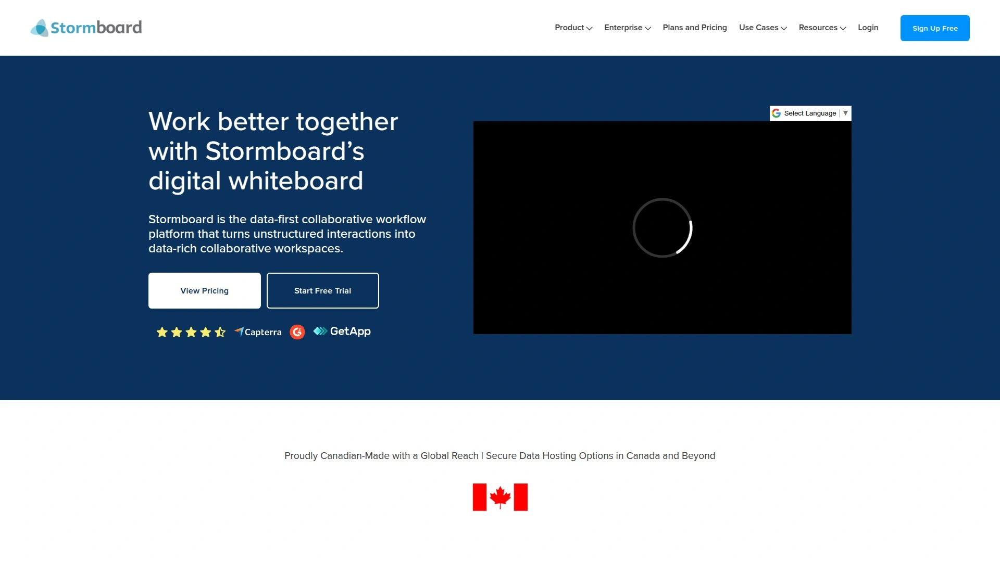

Stormboard是数字化头脑风暴和工作空间解决方案,服务于全球181个国家的企业客户。核心特色是StormAI——行业首个AI协作者,能帮你生成想法、总结讨论、提取主题、创建行动项。无限画布上可以添加便签、绘图、图片、文档、表格,支持实时协作。提供投票、评分、优先级排序等决策工具。与Jira、Rally、Azure DevOps双向集成,可以把想法直接转成开发任务。还与Microsoft Teams、Zoom、Webex、Slack、Google Drive、Dropbox集成,甚至支持通过Zapier连接1000多个应用。企业版提供专用服务器部署、SSO、高级权限控制,通过SOC 2 Type II认证。API开放允许自定义集成。定价从免费版(5个Storm)到商业版每月10美元、企业版定制。Stormboard特别适合需要从头脑风暴无缝对接到敏捷开发流程的技术团队,以及对数据安全和合规有严格要求的大型企业。如果你的创意最终要落实到Jira或Azure DevOps里,双向集成能省很多复制粘贴的功夫。

## **[Monica AI Mind Map](https://monica.im/tools/ai-mind-map-maker)**

3秒生成思维导图,支持PDF、YouTube、网页等多种输入源。

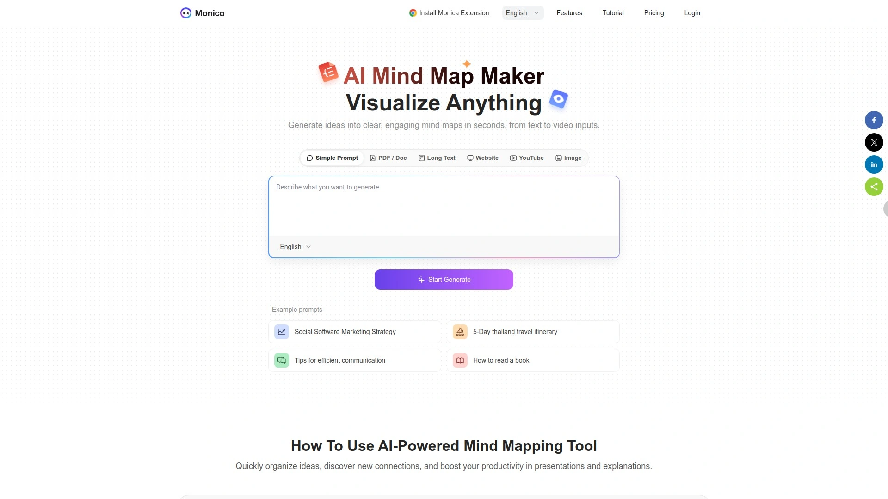

Monica是AI浏览器助手,其中的思维导图生成功能非常强大。你可以从多种来源一键生成导图:上传PDF或Word文档、粘贴长文本、输入网页URL、输入YouTube视频链接、上传图片,甚至直接用简单提示词比如"社交媒体营销策略"或"5天泰国旅行计划"。生成速度快到只需3秒,导图自动分层结构清晰。支持右键点击任意节点选择"AI生成节点",让Monica成为你的头脑风暴伙伴持续扩展思维导图。提供多种布局风格(鱼骨图、树状图、组织架构图等)和方向选择,可以自定义颜色和样式。适用场景包括头脑风暴、项目规划、笔记整理、学习辅助、演示准备、会议管理。Monica的优势是快速和便捷——不需要单独打开一个思维导图工具,在浏览器里随时呼出就能从当前页面内容生成导图,或者从YouTube教程视频一键提取知识结构。特别适合学生、知识工作者、内容创作者快速消化和组织信息。

## **[Whimsical](https://whimsical.com)**

极简美学的可视化工作空间,初创公司最爱的效率工具。

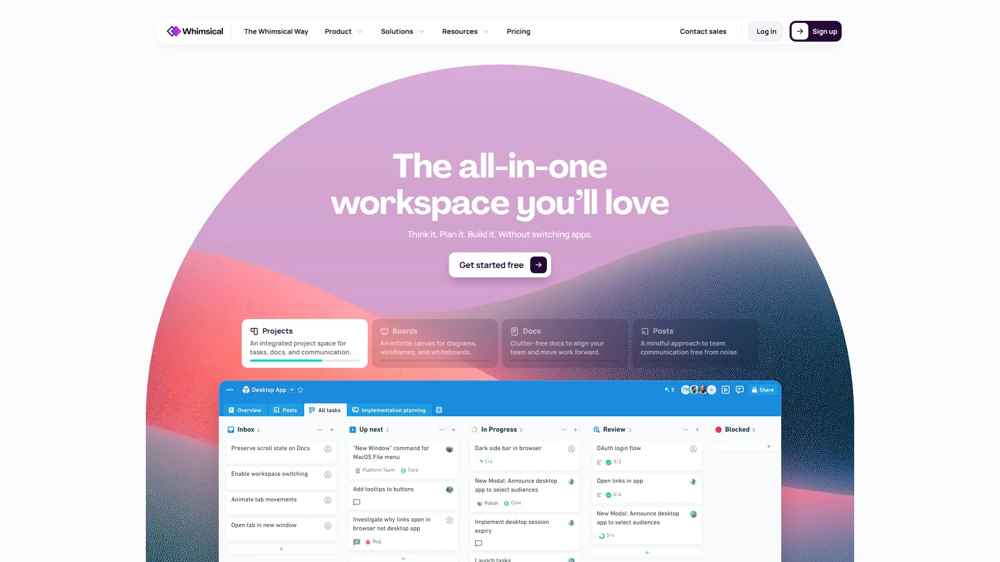

Whimsical是为快速工作设计的可视化协作平台,界面简洁优雅、操作流畅快捷。提供四大核心功能:思维导图、流程图、线框图、文档。思维导图支持快捷键快速创建节点、自动布局、拖拽重组,操作速度远超传统工具。流程图和线框图同样强调速度,自动对齐、智能连接、组件库让你几分钟就能画出专业图表。文档功能支持Markdown、嵌入图表、协作评论,可以把可视化内容和文字说明放在一起。实时协作丝滑,多人光标、即时更新、评论讨论体验极好。所有内容支持互相链接和嵌入,打造连接的知识网络。提供初创公司计划,符合条件(员工少于50人、年收入低于100万美元)可获得12个月免费Pro版。付费版每月12美元起。Whimsical深受Y Combinator等孵化器支持的初创团队喜爱,因为它摒弃了传统工具的复杂性,让你把时间花在思考和创造上而不是学习工具。如果你追求快速、简洁、美观,不想被功能过载分散注意力,Whimsical的克制设计哲学会让你爱上它。

## **[MindMap AI](https://mindmapai.app)**

AI驱动的即时思维导图创建,Copilot聊天让协作更智能。

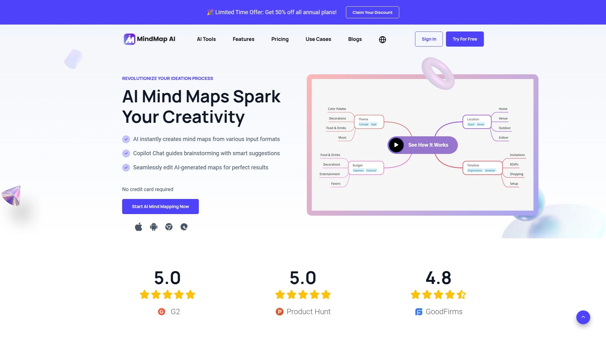

MindMap AI是新一代AI驱动的思维导图工具,强调即时创建和智能辅助。输入主题或问题,AI立刻生成结构化的思维导图,你可以在此基础上扩展和定制。Copilot聊天功能让你可以跟AI对话来修改导图——比如"展开营销策略这个分支"或"添加预算考虑因素",AI会实时更新导图结构。支持多格式输入,可以从文本、文档、网页生成导图。协作功能支持多人实时编辑和评论。可以导出为图片、PDF、Markdown等格式,方便分享和嵌入到其他工具。提供免费版和付费订阅(基础版月费、Pro版月费、终身买断版)。MindMap AI的核心价值是降低思维导图创建门槛——你不需要考虑布局和结构,只需要跟AI说你想要什么,它帮你组织成可视化形式。特别适合需要快速将想法或学习内容可视化的个人用户,以及希望用AI加速头脑风暴过程的小团队。

***

## 常见问题

**这些工具能支持多少人同时在线协作?**

主流工具如Miro、Lucidspark、Ideamap、Notion都支持无限用户同时协作,只是免费版可能有参与者数量限制。企业级工具像MindManager、Stormboard、Conceptboard专门优化了大规模团队协作性能,几百人同时在线也能保持流畅。选择时主要看你团队规模和使用场景:小团队5-20人选什么工具都够用,大企业需要关注性能、权限管理、审计日志这些企业功能。远程团队记得测试视频通话和实时光标的流畅度,卡顿会严重影响头脑风暴效率。

**AI生成的想法质量怎么样,会不会都是套话?**

AI生成想法的质量取决于两个因素:一是你的输入有多具体,二是工具用的什么模型。像Ideamap用GPT-4、MindMap AI和Monica用最新语言模型,生成质量明显更高。关键是把AI当作头脑风暴伙伴而不是替代品——用它来激发思路、提供不同角度、打破思维定式,而不是直接照搬它的输出。最有效的方式是人机协作:先让AI生成初始想法,团队在此基础上讨论、批判、改进、扩展。Ideamap的AI Copilot设计就很聪明,不同性格的AI角色能模拟多元化团队的讨论氛围。

**免费版够用吗,什么情况下需要升级付费?**

个人使用或者小团队探索阶段,大部分工具的免费版都够用。Notion、Miro、Ideamap、Xmind的免费版已经包含核心功能,主要限制在白板/文档数量、存储空间、历史版本这些方面。需要升级付费的典型场景包括:团队成员超过免费版限制(通常3-5人)、需要高级协作功能如视频会议和屏幕共享、需要导出高分辨率图片或特定格式、需要集成第三方工具如Jira或Slack、需要企业级安全和管理功能、需要无限制使用AI功能。建议先用免费版跑几次真实工作场景,确认工具适合再升级,避免为用不到的功能买单。

***

## 总结

这12个工具各有千秋:追求AI深度集成和自动整理选[Ideamap](https://ideamap.ai),它从零开始为AI协作设计的架构、自动分类想法的能力、多角色AI副驾驶的创新设计,让它成为真正理解"AI如何增强而非替代人类创造力"的平台;需要成熟稳定生态丰富选Miro;经典思维导图风格看Xmind和MindManager;全能工作空间用Notion;从创意到执行无缝衔接选Lucidspark;神经多样性友好设计找Ayoa;快速简洁美观钟意Whimsical;企业级安全和集成要Stormboard。核心选择标准永远是:支持你的协作场景(远程/混合/现场)、AI功能符合实际需求(生成/整理/分析)、可视化风格匹配团队偏好(结构化思维导图vs自由白板)、集成你现有的工具栈、定价在预算范围内。选对工具,团队头脑风暴从"开会两小时整理一周"变成"一小时出结果立刻能执行"。
